# phase-diagrams.md — Locked Build Phases

## Global gate

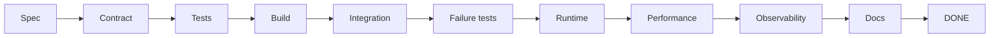

## Phase 0 — Contracts

```text
backend/src/contracts/
execution.py
task.py
worker_result.py
completion.py
decision.py
evidence.py
media_location.py
route.py
trip.py
```

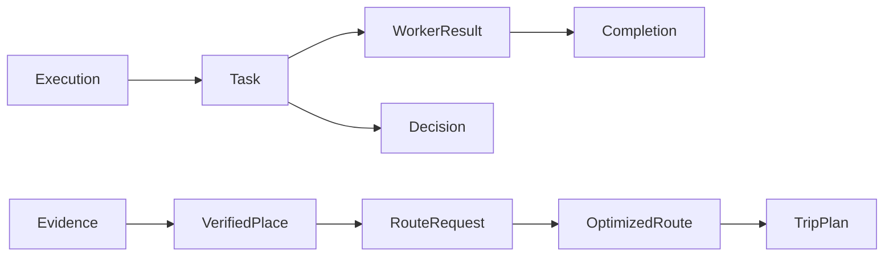

No product code yet.

## Phase 1 — Execution Core

```text
backend/src/application/execution/
service.py
idempotency.py
lease.py
lifecycle.py
```

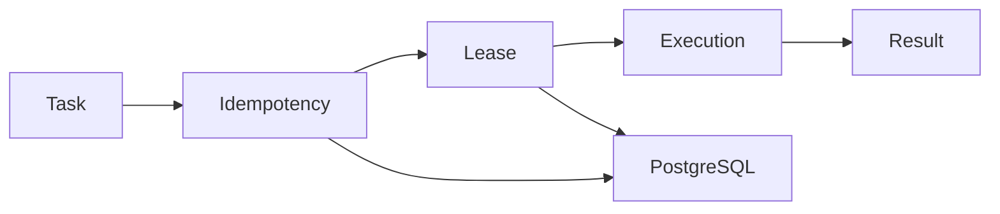

## Phase 2 — Observability

```text
backend/src/observability/
logging.py
tracing.py
metrics.py
audit.py
cost.py
```

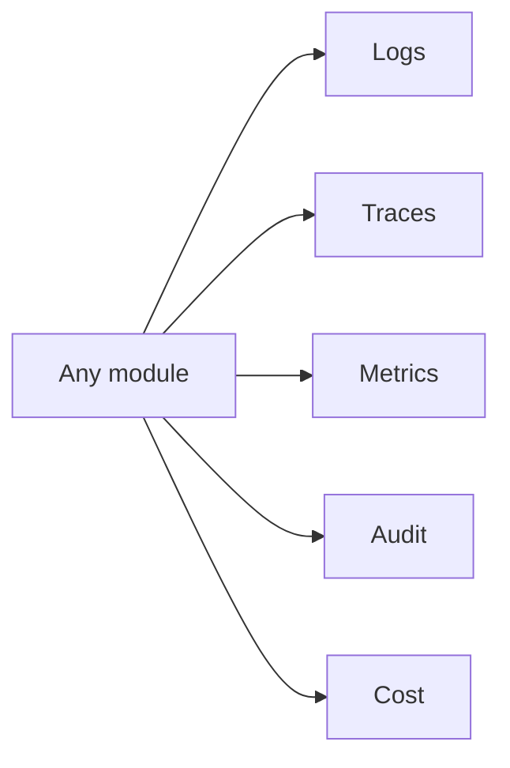

## Phase 3 — Queue Runtime

```text
backend/src/infrastructure/aws/
sqs.py
s3.py
lambda_runtime.py

backend/src/functions/orchestrator/dispatcher.py
```

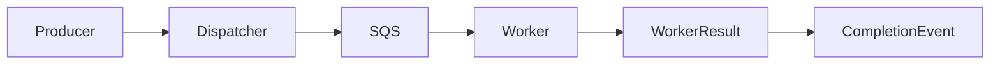

## Phase 4 — Evidence Collector

```text
backend/src/functions/evidence_collector/
handler.py
service.py
schemas.py
repository.py
search.py
scrape.py
```

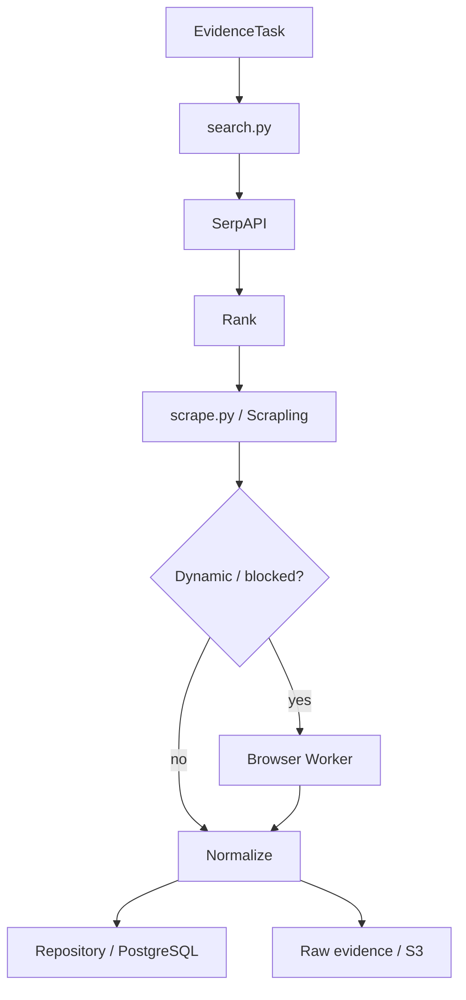

## Phase 5 — Browser

```text
backend/src/functions/browser/
handler.ts
service.ts
schemas.ts
```

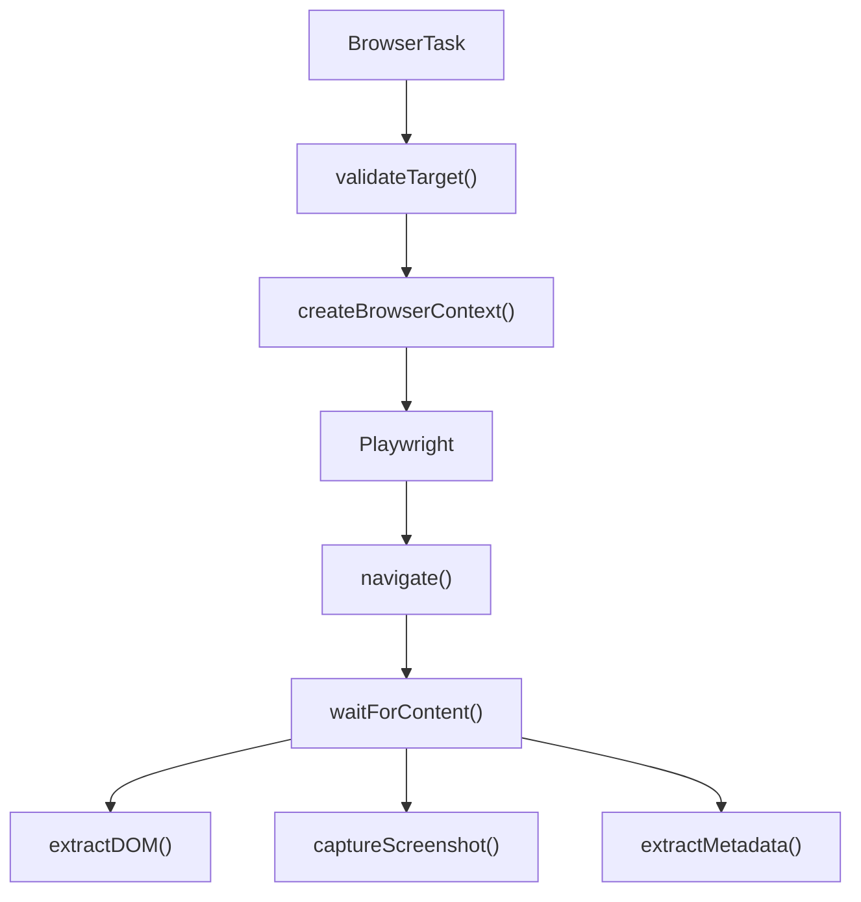

## Phase 6 — LAYA

```text
backend/src/functions/decision_router/
handler.py
service.py
schemas.py
policies.py
```

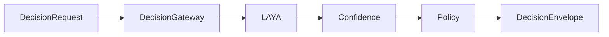

Functions:

```text
decide()
choice()
score()
noul()
route()
triage()
guardrail()
```

## Phase 7 — Media Extractor

```text
backend/src/functions/media_extractor/
handler.py
service.py
schemas.py
repository.py
audio.py
frames.py
```

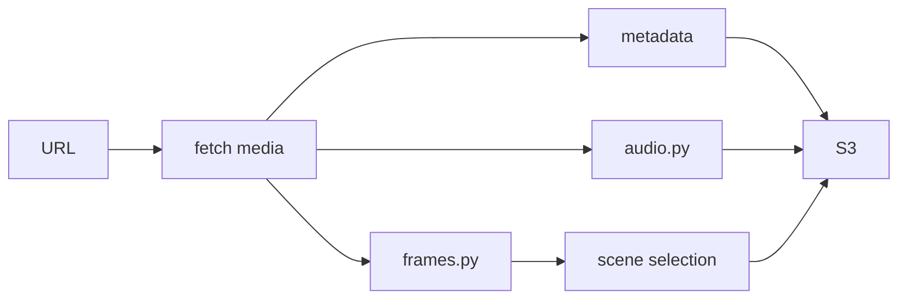

## Phase 8 — Media Analyzer

```text
backend/src/functions/media_analyzer/
handler.py
service.py
schemas.py
repository.py
ocr.py
transcription.py
scene_filter.py
```

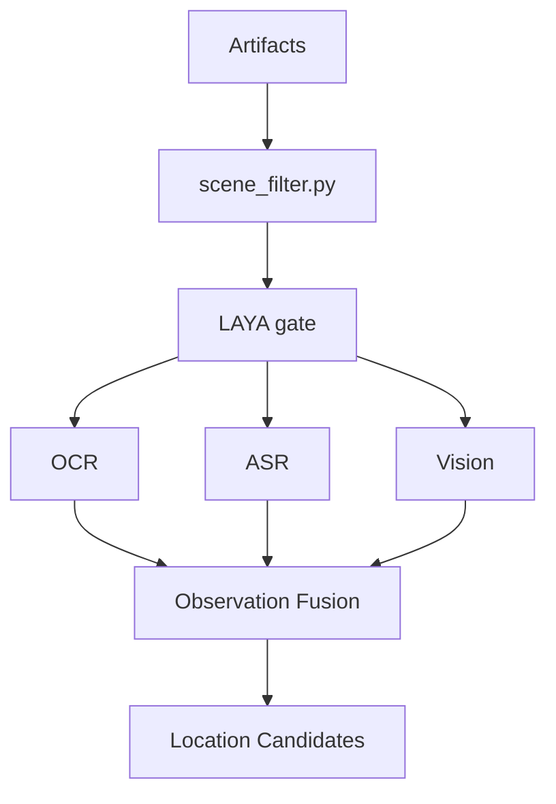

## Phase 9 — Media Location Product

```text
backend/src/workflows/media_location/
graph.py
state.py
nodes.py
policies.py
```

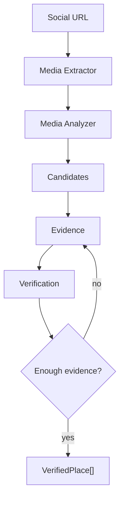

Output: `VerifiedPlace[]`.

## Phase 10 — Route Optimizer

```text
backend/src/functions/optimizer/
handler.py
service.py
schemas.py
repository.py
solver.py
routing.py
constraints.py
costs.py

backend/src/workflows/route_optimizer/
graph.py
state.py
nodes.py
policies.py
```

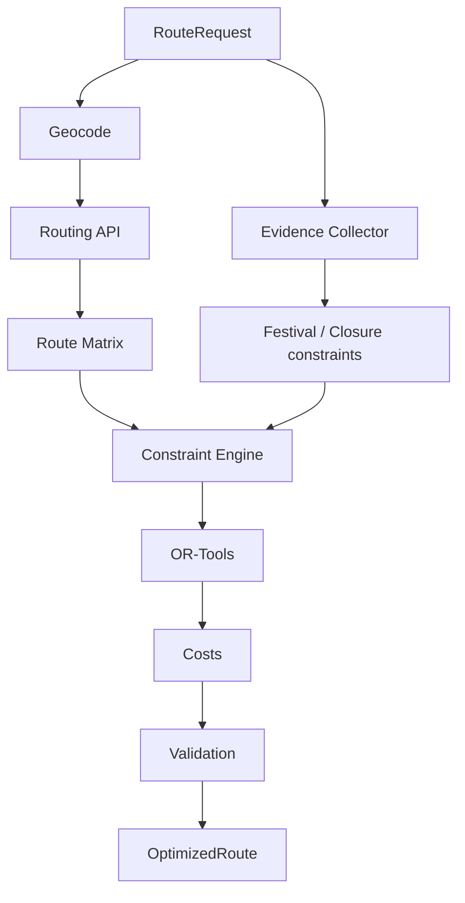

## Phase 11 — Travel Planner + Destination Intelligence

```text
backend/src/workflows/trip_planner/
graph.py
state.py
nodes.py
policies.py

backend/src/functions/destination_intelligence/
handler.py
service.py
schemas.py
repository.py

backend/src/domain/destination/
insights.py
categories.py

backend/src/domain/experience/
ranking.py
```

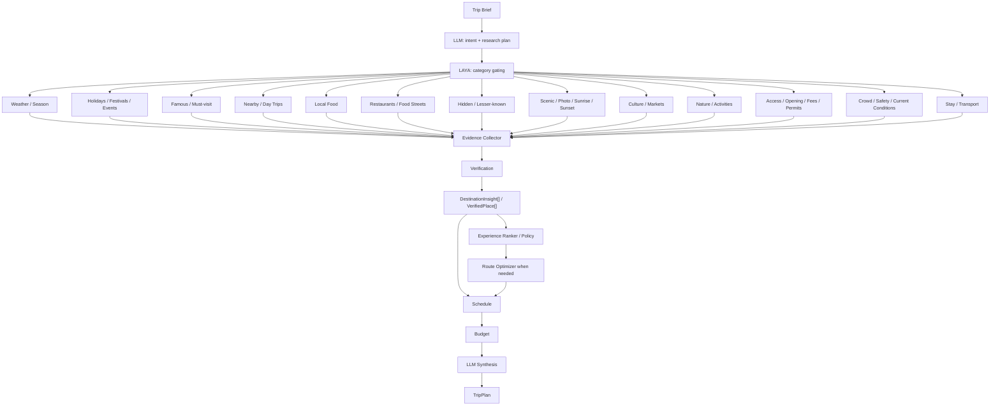

### Phase 11 acceptance

A Travel Planner implementation is not complete if it only produces attractions + route + budget. It must demonstrate category-aware destination research for relevant scenarios and preserve evidence/freshness for time-sensitive claims.

## Phase 12 — Orchestrator + Composition

```text
backend/src/functions/orchestrator/
handler.py
service.py
repository.py
dispatcher.py
state.py
llm.py
tools/
```

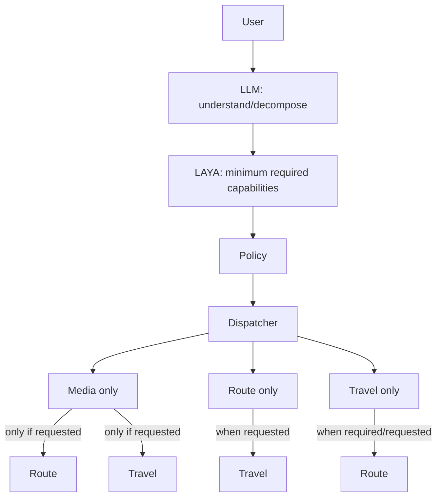

## Phase 13 — Public API

```text
backend/src/functions/api/
handler.py
app.py
service.py
schemas.py
routes/
```

Target:

```text
POST /api/v1/trips
POST /api/v1/trips/{id}/plans
POST /api/v1/discovery/media
POST /api/v1/optimization/routes
GET  /api/v1/jobs/{job_id}
POST /api/v1/jobs/{job_id}/cancel
GET  /api/v1/jobs/{job_id}/events
```

## Phase 14 — E2E + Hardening

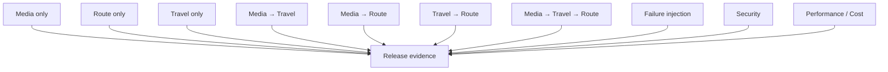

## Locked order

```text
0 Contracts
1 Execution Core
2 Observability
3 Queue Runtime
4 Evidence Collector
5 Browser
6 LAYA
7 Media Extractor
8 Media Analyzer
9 Media Location
10 Route Optimizer
11 Travel Planner
12 Orchestrator + Composition
13 Public API
14 E2E + Hardening
```
