# Diagrams — workflow and development debug map

Read ARCHITECTURE.md for ownership and TECHNICAL_SPEC.md for payloads. Each diagram shows one relationship. Worker arrows represent task/completion contracts, not direct function imports. Limits and waiting paths are explicit.

## Debug lookup
| Symptom | Diagram | Check |
|---|---|---|
| Wrong worker/tool or unexpected extra capability | 1 and 8 | Accepted scope, typed plan, LAYA proposal, Policy gate |
| Stuck/duplicate job | 2 | Outbox, queue age, lease fencing, pending IDs and terminal outcomes |
| Unsupported confident answer | 3 | Claim evidence, duplicates, scope, freshness and policy transition |
| Route crosses closure/vehicle zone | 4 | Restriction geometry, provider support, actual traversal and hub mode continuity |
| Reroute changes visited stops | 5 | Completed-stop snapshot, current GPS/time, expected route version |
| Wrong/forced media identity | 6 | Frame/audio timestamps, OCR/ASR support, candidate uncertainty |
| Generic itinerary missing local experiences | 7 | Relevant category tasks, missing-data branches, ranking and schedule |
| Phase order/path drift | Development diagrams | DEVELOPMENT.md phase table and ARCHITECTURE.md folder ownership |

Diagrams visualize the specifications; they do not override contracts. All loops have execution deadline/call/repair limits. A “no budget” branch is terminal partial/failed/waiting-user as appropriate.

## 1. Harness: LLM, LAYA, policy and tool calls
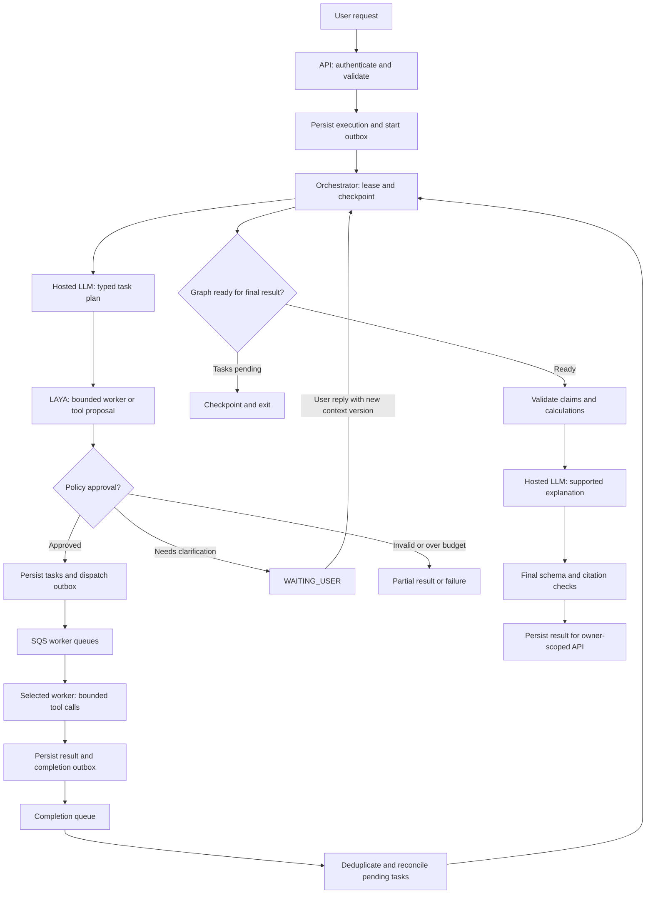
Initial plan proposal runs once per needed plan revision, not on every completion. Ready nodes may be deterministic and skip LLM/LAYA. Store does not contain hidden chain-of-thought; short explanations and evidence references are sufficient.

## 2. Durable task delivery and recovery
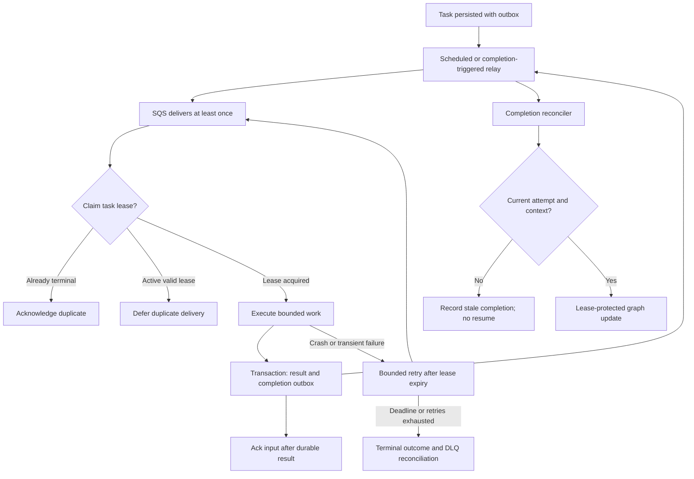
A send that succeeds before marking an outbox row delivered can duplicate messages; consumers deduplicate by logical IDs. Transactional results survive ack/send crashes. DB unavailability is retried without pretending task success.

## 3. Research and verification
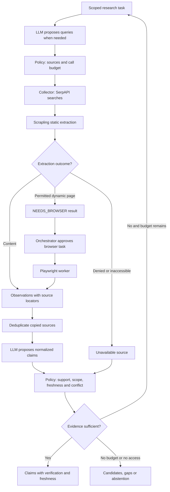
Browser is not an anti-bot bypass. Unknown dates do not become fresh publication dates. Claims may stay conflicted even when multiple sources repeat them.

## 4. Route optimization and closures
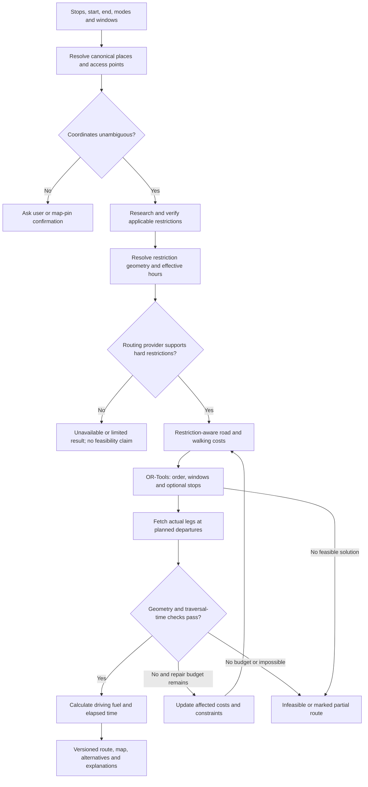
Vehicle-zone visits create permitted parking/access hubs plus walking legs; check walking limits and parking-return requirements. Time-based closure affects passage through a road, not just arrival at an attraction. Unverified closure is a warning and labeled avoidance alternative.

## 5. Mid-trip replanning
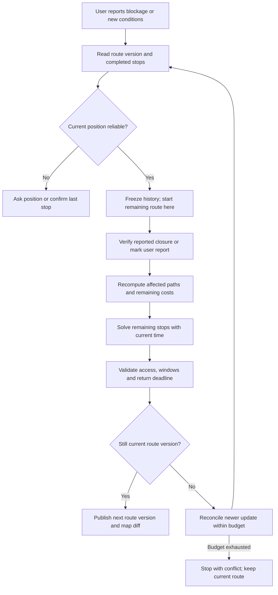
A visited A/B stays unchanged. A B→C blockage while travelling uses current position, not teleportation back to B. Changed arrival times may require reordering C/D/E and changing skipped stops.

## 6. Media location: extraction, analysis and uncertainty
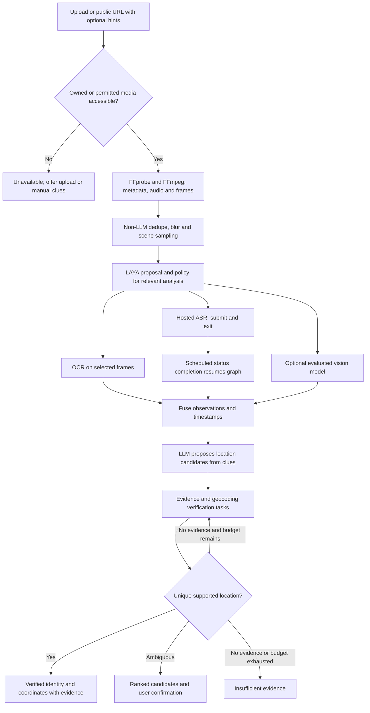
Optional/skipped nodes yield a terminal skipped outcome so joins cannot wait forever. Missing audio is not extraction failure for a still image. No automatic trip starts after output.

## 7. Travel: destination intelligence and practical plan
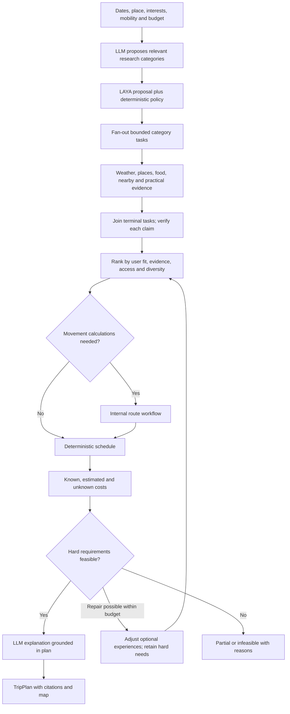
Relevant research includes weather/season, festivals/events, landmarks, nearby/day trips, dishes/eateries, hidden candidates, scenic/photo, culture/nature, hours/fees/permits, crowds/safety, stays/transport. Each task carries category and evidence IDs; this is not a thirteen-agent mandatory fan-out.

## 8. Product composition and acceptance
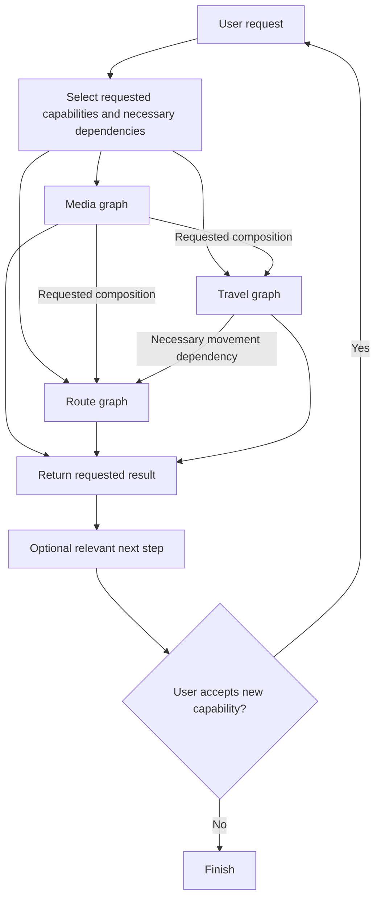
These are logical product dependencies. The queue/lease flow in diagram 1 governs execution. A travel graph consumes route output; it does not recursively start a second travel graph.

## Development phase diagrams

## Foundation: phases 0–3
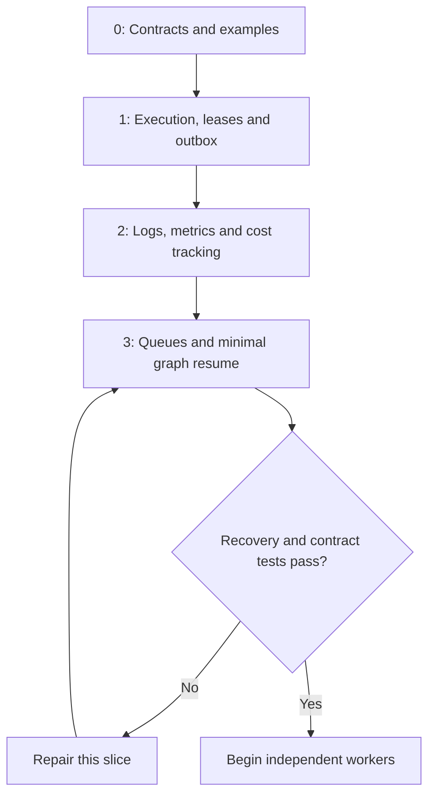
Paths: contracts/; functions/orchestrator/execution/; utils/logger.py and module-owned telemetry; functions/orchestrator/dispatcher.py. Minimal API health/job route lives in functions/api/.

## Evidence and decision: phases 4–6
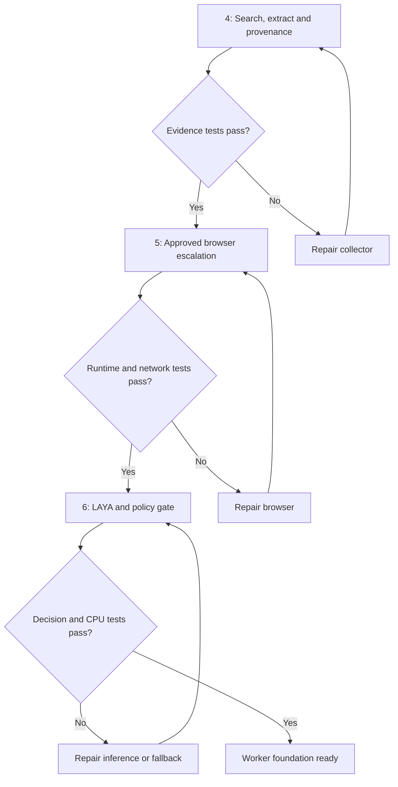
Paths: functions/evidence_collector/; functions/browser/; functions/decision_router/. Independent fixture tests precede credentialed live smoke tests.

## Route vertical slice: phases 7–8
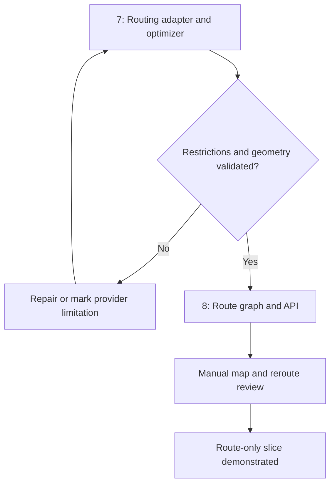
Paths: functions/optimizer/; functions/orchestrator/graphs/route_optimizer/; functions/api/routes/optimization.py. A provider limitation does not count as completed production closure support.

## Media vertical slice: phases 9–11
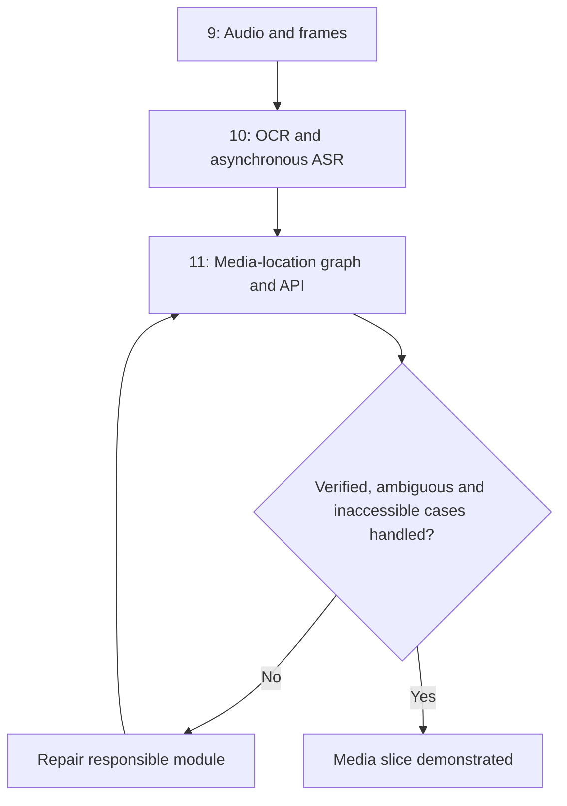
Paths: functions/media_extractor/; functions/media_analyzer/; functions/orchestrator/graphs/media_location/. No duplicated global workflows folder.

## Travel and release: phases 12–14
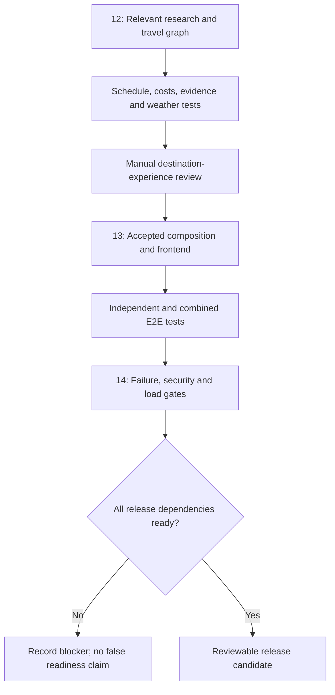
Path: functions/orchestrator/graphs/trip_planner/ owns research/ranking/schedule/budget. No mandatory destination_intelligence Lambda. Phases.md is the authoritative phase table.
